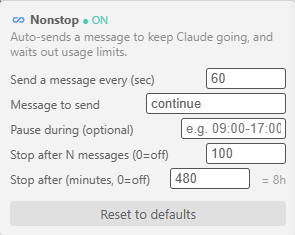

# Claude Code Nonstop ♾️

A VS Code extension that keeps Claude Code going — even after you hit a usage limit. It adds an on/off toggle inside the Claude panel, automatically "pings" Claude to continue long-running tasks, and when you hit a rate limit it **waits until the window resets and automatically resumes the last task**. Great for overnight runs — but not only: any time your limit runs out mid-work, flip it on and forget about it.


*Nonstop adds a ♾️ toggle to the Claude Code footer (left of the mode button). Click to start/stop — it pulses while active.*



*Right-click the ♾️ button for quick settings — interval, message, quiet hours, and stop limits.*

> **Status: in development (0.1.2).** The host core and the injected script are covered by unit tests and verified live in the panel — including a real overnight run that waited out a usage limit and resumed the task automatically. Rate-limit reset times are parsed in their reported timezone, with a safe fixed-wait fallback.

## How it works

VS Code has no API for adding buttons to the Claude Code panel, so the extension uses a proven **webview-injection** technique:

1. On the host side (`src/extension.js`) it locates the active Claude Code version and appends the `webview/nonstop.js` script to the end of that version's `webview/index.js` file (with a backup and an atomic write).
2. The injected script runs inside the panel's DOM: it builds a button in the footer, detects when Claude is waiting to continue, and sends a "ping".

The injection is **marker-based and two-sided** so it coexists peacefully with any other extension that injects into the same file.

## Timing — what gets sent and when

* The `tick` engine runs every second (`pollMs`). **When off, it exits immediately; nothing is sent.**
* When on, every second it detects the state and acts:
  * **Claude is working** (output is growing) → wait.
  * **Rate limit** → sleep until the reset time, then resume.
  * **Question** → stop (or send a neutral answer, per `onQuestion`).
  * **Waiting to continue** → if `pingIntervalMs` (60s) has passed since the last ping → send `pingText` ("continue").
* Before every send: not in quiet hours, no draft of yours in the input box, and you haven't typed in the box within the last `userActivityPauseMs`.
* Stops automatically on: completion detection, `maxPings`, `maxRuntimeMs`, or a manual toggle off.

## Usage

* Clicking the footer button toggles it on/off. While on, it pulses.
* Commands (Command Palette): `Nonstop: Check & Inject`, `Nonstop: Remove Injection`, `Nonstop: Menu`.
* After the first injection — Reload Window so the script loads.

## Key settings

| Setting | Default | What |
| --- | --- | --- |
| `nonstop.pingText` | `continue` | The message sent on each ping |
| `nonstop.pingIntervalMs` | `60000` | Minimum interval between pings |
| `nonstop.maxRuntimeMs` | `28800000` (8h) | Max run length (rate-limit sleep time is not counted) |
| `nonstop.maxPings` | `100` | Max pings per shift |
| `nonstop.quietHours` | `""` | Optional window where the extension stays silent, e.g. `09:00-17:00` (so it runs overnight) |
| `nonstop.onQuestion` | `stop` | When Claude asks a question: `stop` or `answer` |
| `nonstop.rateLimitFallbackMs` | `18000000` (5h) | Wait time when an exact reset time can't be determined |
| `nonstop.debug` | `false` | Verbose recon logging in the panel console |

## Safety

* **Reliable stop = the off button in the panel.** (The host's "Stop Now" command is best-effort only — there is no host↔webview channel in the MVP.)
* `maxRuntime`/`maxPings` caps, quiet hours, and a pause when user activity is detected all prevent a runaway loop.
* Against a rate limit the extension **sleeps** until reset instead of pinging in a loop.

## Terms-of-service warning

Unsupervised, automated continuation of a model may violate the provider's usage policy and/or burn quota on unwanted work. Use at your own risk. The defaults are intentionally conservative.

## Development

```
npm test     # host unit tests (18 tests)
```

See [SPEC.md](SPEC.md) for the full spec, [RECON.md](RECON.md) for the recon findings, and [TASKS.md](TASKS.md) for tracking.

## License

MIT — see [LICENSE](LICENSE).
